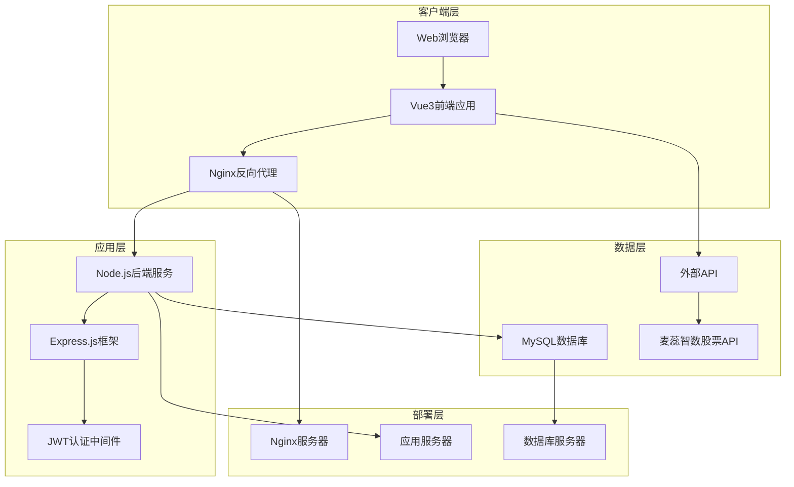
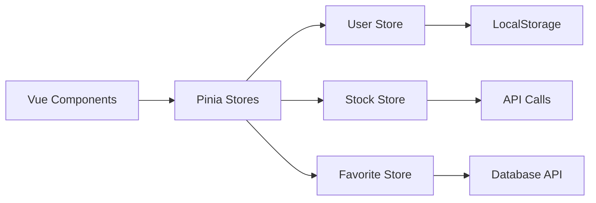
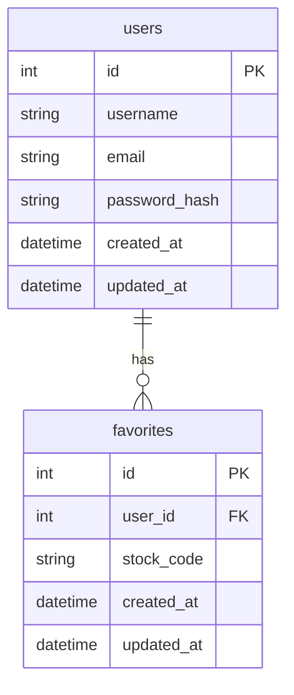
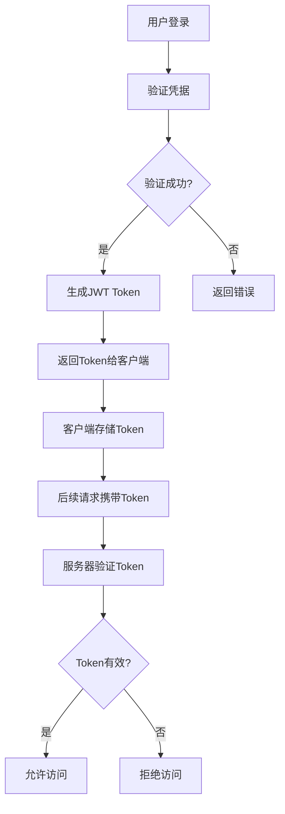
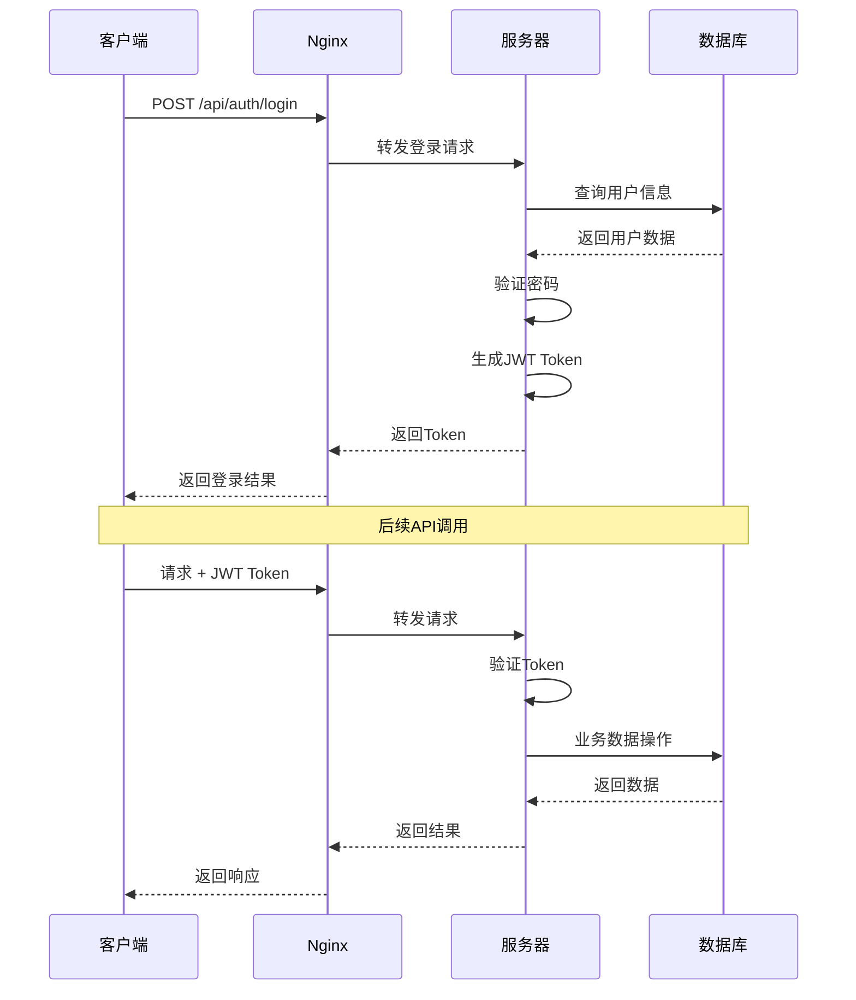
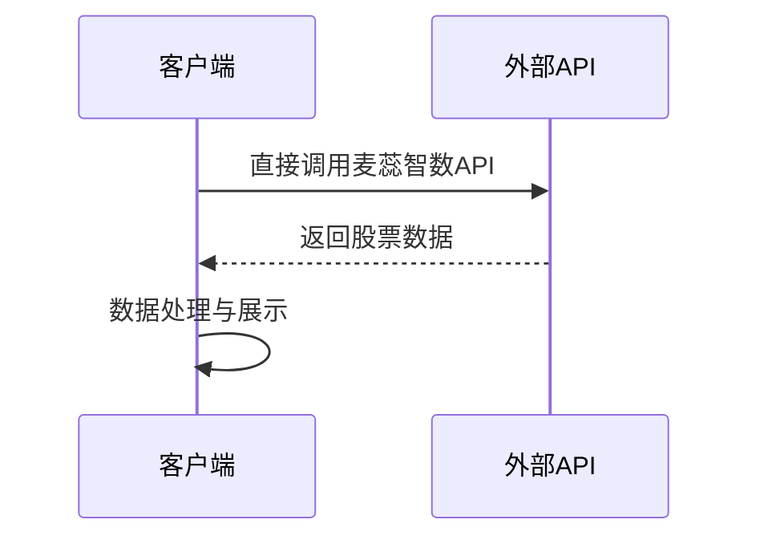
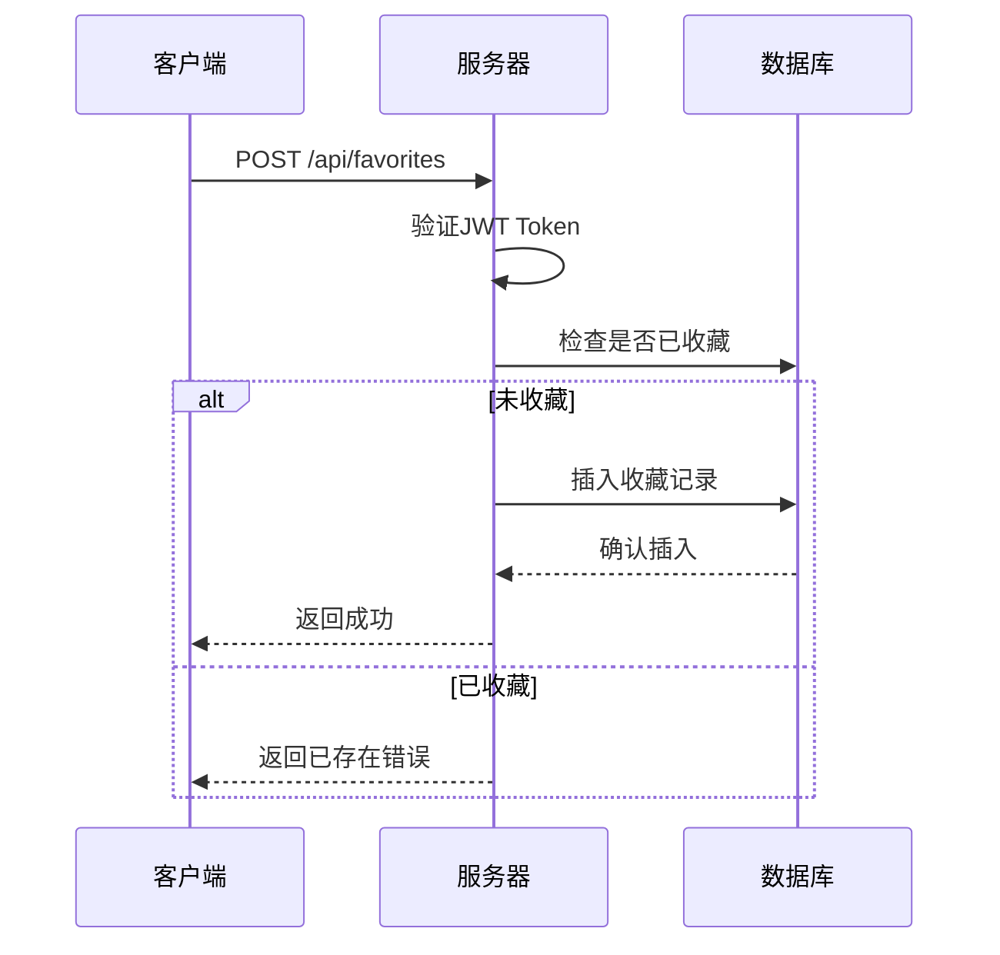

# iStock 智能股票管理系统 - 架构文档

## 📋 目录
- [系统概述](#系统概述)
- [整体架构](#整体架构)
- [前端架构](#前端架构)
- [后端架构](#后端架构)
- [数据库设计](#数据库设计)
- [API接口设计](#api接口设计)
- [安全架构](#安全架构)
- [技术选型](#技术选型)
- [系统流程](#系统流程)

## 🌟 系统概述

iStock智能股票管理系统采用现代化的前后端分离架构，基于微服务设计理念，通过模块化设计实现高内聚、低耦合的系统结构。

### 核心特性
- **前后端分离**：前端Vue3 + 后端Node.js独立部署
- **数据分离**：用户数据存储MySQL，股票数据前端直连API
- **外部集成**：前端直接调用麦蕊智数股票数据API
- **安全认证**：JWT token身份验证机制（仅用户管理）

## 🏗️ 整体架构



### 架构层次
1. **表现层**：Vue3 + TypeScript + ECharts
2. **网关层**：Nginx反向代理 + 负载均衡
3. **应用层**：Node.js + Express.js + JWT（仅用户认证）
4. **数据层**：MySQL（用户数据）+ 前端直连外部API（股票数据）

## 🎨 前端架构

### 技术栈架构
```
Vue3 3.5.25
├── Composition API
├── TypeScript 支持
├── Vue Router 4.6.3 (路由管理)
├── Pinia 3.0.4 (状态管理)
├── ECharts 6.0 (数据可视化)
└── Axios (HTTP客户端)
```

### 组件架构
```
src/
├── components/          # 通用组件
│   ├── Header.vue       # 页面头部
│   ├── Footer.vue       # 页面底部
│   ├── StockCard.vue    # 股票卡片
│   └── ChartView.vue    # 图表组件
├── views/              # 页面组件
│   ├── Home.vue        # 首页
│   ├── Login.vue       # 登录页
│   ├── Register.vue    # 注册页
│   ├── Dashboard.vue   # 仪表板
│   ├── Favorites.vue   # 收藏管理
│   └── Introduction.vue # 项目介绍
├── stores/             # 状态管理
│   ├── user.js         # 用户状态
│   ├── stock.js        # 股票状态
│   └── favorite.js     # 收藏状态
├── router/             # 路由配置
│   └── index.js        # 路由定义
├── api/                # API接口
│   ├── auth.js         # 认证接口
│   ├── stock.js        # 股票接口
│   └── favorite.js     # 收藏接口
└── utils/              # 工具函数
    ├── request.js       # 请求封装
    └── storage.js      # 存储工具
```

### 状态管理架构


## 🖥️ 后端架构

### 服务架构设计
```
Node.js + Express.js
├── 中间件层
│   ├── CORS           # 跨域处理
│   ├── BodyParser     # 请求解析
│   ├── JWT Auth       # 身份认证
│   └── ErrorHandler   # 错误处理
├── 路由层
│   ├── /api/auth      # 认证路由
│   ├── /api/users    # 用户路由
│   └── /api/favorites # 收藏路由
├── 控制层
│   ├── AuthController # 认证控制
│   ├── UserController # 用户控制
│   └── FavoriteController # 收藏控制
├── 服务层
│   ├── AuthService    # 认证服务
│   ├── UserService    # 用户服务
│   └── FavoriteService # 收藏服务
└── 数据层
    └── MySQL          # 数据库连接
```

### 模块架构
```javascript
// 核心模块结构
server2.0.js              // 主服务入口
├── config/               # 配置模块
│   ├── database.js      # 数据库配置
│   └── jwt.js           # JWT配置
├── middleware/           # 中间件模块
│   ├── auth.js          # 认证中间件
│   ├── validation.js    # 验证中间件
│   └── error.js         # 错误中间件
├── models/              # 数据模型
│   ├── User.js          # 用户模型
│   └── Favorite.js      # 收藏模型
├── routes/              # 路由模块
│   ├── auth.js          # 认证路由
│   ├── users.js         # 用户路由
│   └── favorites.js     # 收藏路由
├── services/            # 服务模块
│   ├── authService.js   # 认证服务
│   ├── userService.js   # 用户服务
│   └── favoriteService.js # 收藏服务
└── utils/               # 工具模块
    ├── database.js      # 数据库工具
    ├── logger.js        # 日志工具
    └── validator.js     # 验证工具
```

## 🗄️ 数据库设计

### 数据库架构


### 表结构设计

#### users 表 - 用户信息
| 字段名 | 类型 | 约束 | 描述 |
|--------|------|------|------|
| id | INT | PK, AUTO_INCREMENT | 用户ID |
| username | VARCHAR(50) | UNIQUE, NOT NULL | 用户名 |
| email | VARCHAR(100) | UNIQUE, NOT NULL | 邮箱 |
| password_hash | VARCHAR(255) | NOT NULL | 密码哈希 |
| created_at | DATETIME | DEFAULT CURRENT_TIMESTAMP | 创建时间 |
| updated_at | DATETIME | DEFAULT CURRENT_TIMESTAMP ON UPDATE | 更新时间 |

#### favorites 表 - 用户收藏
| 字段名 | 类型 | 约束 | 描述 |
|--------|------|------|------|
| id | INT | PK, AUTO_INCREMENT | 收藏ID |
| user_id | INT | FK(users.id), NOT NULL | 用户ID |
| stock_code | VARCHAR(10) | NOT NULL | 股票代码 |
| created_at | DATETIME | DEFAULT CURRENT_TIMESTAMP | 创建时间 |
| updated_at | DATETIME | DEFAULT CURRENT_TIMESTAMP ON UPDATE | 更新时间 |

## 🔌 API接口设计

### RESTful API架构
```mermaid
graph TB
    subgraph "API Gateway"
        A[Nginx] --> B[Node.js API Server]
    end
    
    subgraph "API Layers"
        B --> C[Authentication Layer]
        C --> D[Business Logic Layer]
        D --> E[Data Access Layer]
        E --> F[Database]
    end
    
    subgraph "API Endpoints"
        G[/api/auth/*] --> C
        H[/api/users/*] --> C
        J[/api/favorites/*] --> C
    end
    
    subgraph "External API"
        K[Frontend] --> L[麦蕊智数股票API]
    end
```

### API设计规范

#### 认证API (/api/auth)
| 方法 | 端点 | 描述 | 参数 |
|------|------|------|------|
| POST | /register | 用户注册 | username, email, password |
| POST | /login | 用户登录 | username, password |
| POST | /refresh | 刷新Token | refreshToken |
| POST | /logout | 用户登出 | 无 |

#### 用户API (/api/users)
| 方法 | 端点 | 描述 | 参数 |
|------|------|------|------|
| GET | /profile | 获取用户信息 | 无 |
| PUT | /profile | 更新用户信息 | username, email |
| PUT | /password | 修改密码 | oldPassword, newPassword |

#### 收藏API (/api/favorites)
| 方法 | 端点 | 描述 | 参数 |
|------|------|------|------|
| GET | / | 获取收藏列表 | page, limit |
| POST | / | 添加收藏 | stockCode |
| DELETE | /:code | 取消收藏 | stockCode |
| GET | /check/:code | 检查是否收藏 | stockCode |

### 请求/响应格式
```javascript
// 标准请求格式
{
  "method": "POST",
  "headers": {
    "Content-Type": "application/json",
    "Authorization": "Bearer <JWT_TOKEN>"
  },
  "data": {
    // 请求数据
  }
}

// 标准响应格式
{
  "success": true,
  "data": {
    // 响应数据
  },
  "message": "操作成功",
  "timestamp": "2024-01-01T00:00:00.000Z"
}

// 错误响应格式
{
  "success": false,
  "error": {
    "code": "VALIDATION_ERROR",
    "message": "参数验证失败",
    "details": []
  },
  "timestamp": "2024-01-01T00:00:00.000Z"
}
```

## 🔒 安全架构

### 认证与授权


### JWT Token结构
```json
{
  "header": {
    "alg": "HS256",
    "typ": "JWT"
  },
  "payload": {
    "sub": "user_id",
    "username": "张三",
    "email": "zhangsan@example.com",
    "iat": 1516239022,
    "exp": 1516242622
  },
  "signature": "signature_hash"
}
```

### 安全措施
1. **密码安全**：使用bcrypt进行密码哈希
2. **Token安全**：JWT有效期控制，定期刷新
3. **输入验证**：所有用户输入进行格式验证
4. **SQL注入防护**：使用参数化查询
5. **CORS配置**：跨域请求控制
6. **速率限制**：API调用频率限制
7. **HTTPS传输**：生产环境强制HTTPS

## 🛠️ 技术选型

### 前端技术选型
| 技术 | 版本 | 选型理由 |
|------|------|----------|
| Vue3 | 3.5.25 | 现代化响应式框架，Composition API提高代码复用性 |
| TypeScript | 5.9.0 | 类型安全，提高开发效率和代码质量 |
| Pinia | 3.0.4 | Vue官方推荐的状态管理，简单易用 |
| Vue Router | 4.6.3 | 官方路由管理器，支持路由守卫 |
| ECharts | 6.0.0 | 强大的数据可视化库，图表丰富 |
| Vite | 7.2.4 | 现代化构建工具，开发体验好 |

### 后端技术选型
| 技术 | 版本 | 选型理由 |
|------|------|----------|
| Node.js | 18+ | JavaScript运行时，异步I/O性能优秀 |
| Express.js | 4.18.2 | 成熟的Web框架，生态丰富 |
| MySQL | 8.0+ | 成熟的关系型数据库，ACID事务支持 |
| JWT | 9.0.0 | 无状态认证，适合分布式架构 |
| Bcrypt | 2.4.3 | 安全的密码哈希算法 |
| MySQL2 | 3.16.0 | 优秀的MySQL驱动，支持Promise |

### 部署技术选型
| 技术 | 选型理由 |
|------|----------|
| Nginx | 高性能反向代理，静态文件服务，负载均衡 |
| PM2 | Node.js进程管理，自动重启，集群模式 |
| Let's Encrypt | 免费SSL证书，HTTPS支持 |

## 🔄 系统流程

### 用户认证流程


### 股票数据获取流程


### 收藏管理流程


---

